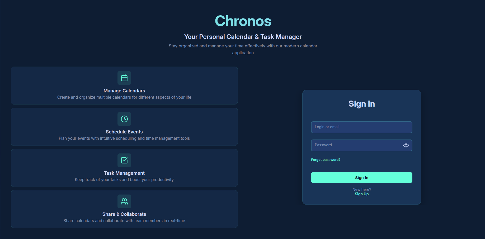
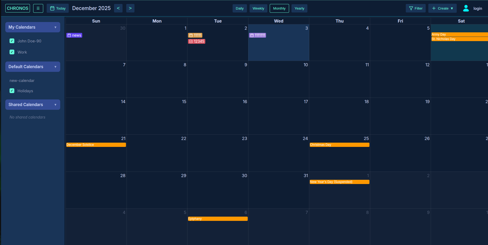
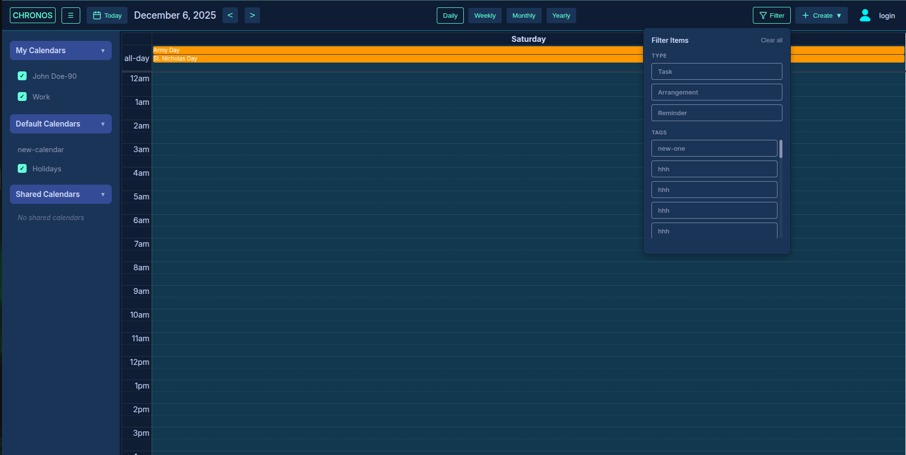
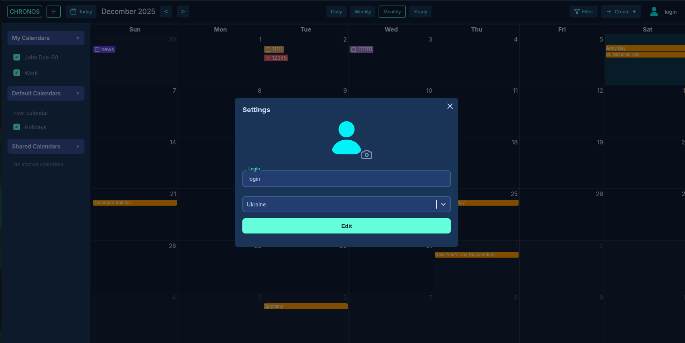
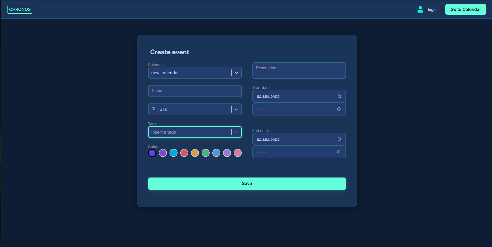

# CHRONOS ⚙️ FRONTEND 

## Program Algorithm 📊
- Authentication
  - Create or enter account (The frontend displays registration or login forms and collects the data entered by the user. It sends this data to the backend and waits for a success or error response. If the backend confirms a successful login, the frontend stores the token or session and redirects the user to the appropriate section of the site.)
  - Log out (The frontend initiates a logout request. Then, the user is redirected to the main page. This ensures that access to protected pages is no longer possible without logging in again.)
- Calendar
  - Create calendar (The frontend opens a modal form for entering the calendar title and description. The user fills in the fields and clicks the save button, then the data is sent to the backend for validation and calendar creation. After receiving a response from the server, the modal closes, and the calendar list is updated or an error message is displayed.)
  - Share calendar (The frontend allows the user to create their own calendar and add other users. After adding a user, the frontend sends a request to the backend to send a joining notification via email. Once confirmed by the server, the frontend displays a message about the successful invitation.)
- Event
  - Create event (The user can create an event in two ways: by navigating to the create-event page or by clicking on the calendar, which opens a modal form. The frontend collects the event data from the form and sends it to the backend for validation and storage. After receiving a response from the server, the frontend closes the modal or shows a confirmation on the page and updates the event list.)
  - Share event (The user selects a calendar and adds a new event through a form. The frontend collects the event data and sends it to the backend for validation and storage. After receiving a response from the server, the frontend shows a confirmation or an error message.)
- Settings (The user can change their avatar and select a holiday region through the profile settings form. The frontend collects the new data and sends it to the backend for validation and storage. After receiving a response from the server, the frontend updates the avatar and region display on the profile and shows a success message.)
- Notification (The user creates an event and selects the “reminder” type through a form or modal window. The frontend sends the event data to the backend for storage and notification scheduling. After receiving confirmation from the server, the frontend displays information about the created event and any reminders.)

## Interface screenshots 📰
### Login page

### Calendar Page

### Daily calendar

### Setting modal

### Create Event
